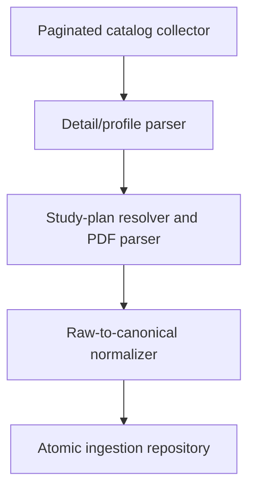

# C4 Container

- Catalog collector owns pagination and catalog/detail request hashes.
- Detail parser owns source-shape traversal and admissions extraction.
- Resolver owns short links, Yandex metadata, download deduplication and source gaps.
- Normalizer owns canonical IDs, direction/program relationships and taxonomy.
- Repository owns ORM, transactionality, stale-row reconciliation and audit records.
