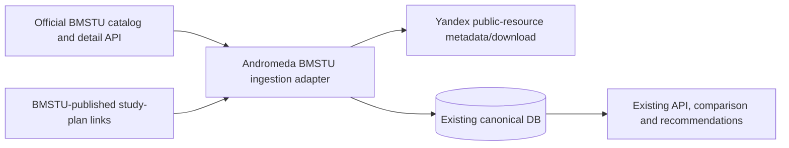

# C4 Context

The only authoritative catalog/detail source is BMSTU. Yandex is a linked document transport, not a catalog of its own. Events and campus remain outside the live full-catalog scope because no complete official live source was established in this research.
