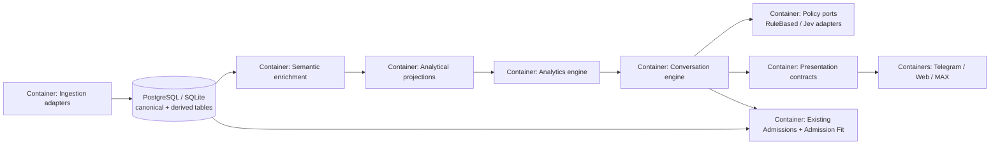

# C4 Container View: Andromeda Universal Analytics

Research: [INDEX.md](INDEX.md)
Parent context: [C4-CONTEXT.md](C4-CONTEXT.md)

## Diagram

## Containers

| Container | Technology | Responsibility | Data owned | Evidence |
|-----------|------------|----------------|------------|----------|
| Ingestion adapters | Python, Pydantic, source parsers | Capture, parse, normalize and validate BMSTU/HSE source data | Raw source DTOs, snapshots, parser diagnostics | `backend/src/andromeda/ingestion` |
| Canonical storage | SQLAlchemy, Alembic, PostgreSQL/SQLite | Atomic persistence of canonical entities and source audit | University, directions, programs, curricula, disciplines, admissions, events, provenance/gaps | `infrastructure/database/models`, `repositories/ingestion.py` |
| Semantic enrichment | Typed Python service + classifier port | Classify non-exclusive semantic features at discipline default and curriculum-item level | Versioned semantic feature assignments and provenance | Target module; no current equivalent |
| Analytical projections | Batch Python builder + SQLAlchemy repository | Build rebuildable program-level metrics, timelines, quality and evidence after ingestion | `program_projections`, `program_metrics`, evidence rows | Current runtime `FingerprintBuilder` is the predecessor |
| Analytics engine | Typed Python application module | Validate QuerySpec, select basis, aggregate persisted metrics and return explainable result | Query/result contracts; no raw SQL input | Target module; current comparison is narrower predecessor |
| Conversation engine | Typed session service + deterministic parser | Merge text/slots, resolve entities, ask bounded clarification, call analytics/admission | QuerySession state and typed actions | Current proftest/decision sessions are specialized predecessors |
| Policy ports | Protocols + deterministic implementations | Choose next action and response representation; allow future Jev adapters | Versioned policy metadata, no domain state | No current generic policy port |
| Presentation contracts | Channel-neutral contracts + report ports | Convert result into text/image/PDF/mini-app envelope and evidence actions | ResponseEnvelope/ReportSpec | Current Telegram/OG selection is transport-owned |
| Channel adapters | FastAPI/Web, Telegram, future MAX | Transport/render envelope without business logic | Opaque channel sessions/callbacks only | `api`, `frontend-next`, `telegram-bot` |

## Relationships

| From | To | Interaction / data | Failure concern | Evidence |
|------|----|----------------------|-----------------|----------|
| Ingestion adapters | Canonical storage | `RawTracerBundle`, `CanonicalSnapshot`, source snapshots | Source gap and quality rejection must not create partial canonical data | `run_andromeda_ingestion.py`, `SqlAlchemyIngestionRepository` |
| Canonical storage | Semantic enrichment | Batch read of affected programs/items and classifier inputs | Classifier failure marks semantic/projection state unavailable, never zero | Current canonical readers and no semantic persistence yet |
| Semantic enrichment | Analytical projections | Versioned feature rows plus classifier metadata | Taxonomy/classifier drift must be observable and rebuildable | Requested versioning/provenance requirements |
| Analytical projections | Analytics engine | Batch/SQL repository reads | Stale/partial metrics must expose status and coverage | Target model; current catalog cache is insufficient |
| Analytics engine | Admissions | Typed candidate/filter adapter | Admission Fit must retain separate semantics and source gaps | `modules/admission_fit`, `modules/decision` |
| Conversation engine | Analytics/policies | QuerySpec, AnalyticsResult and typed decisions | Invalid metric/entity/aggregation must return typed error/clarification | Target APIs; current routes are specialized |
| Presentation contracts | Channels | ResponseEnvelope + actions/deep links | No transport-specific business decisions or raw evidence leakage | Current Telegram and Next OG code show migration boundary |
