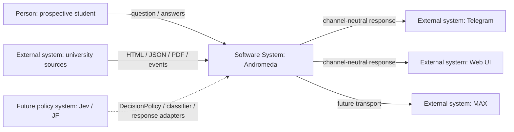

# C4 System Context: Universal Educational Analytics Interface

Research: [INDEX.md](INDEX.md)
Scope: Andromeda educational analytics and decision boundary

## Diagram

## Elements

| Element | Type | Responsibility | Evidence |
|---------|------|----------------|----------|
| Prospective student | Person | Asks educational/comparison/admission questions and supplies missing slots | User request; current frontend and Telegram flows |
| Andromeda | Software system | Owns canonical facts, analytics, admission fit, conversation contracts and response envelope | `README.md`, `docs/architecture.md`, `backend/src/andromeda` |
| University sources | External system | Publish catalog, curriculum, admission, event and campus facts | `backend/src/andromeda/ingestion/universities` |
| Telegram | External transport | Sends messages/images/buttons, stores only opaque encrypted session cookie | `docs/telegram-bot.md`, `telegram-bot/src` |
| Web | External transport/UI | Renders typed public API contracts and existing screens | `frontend-next/src` |
| MAX | Future transport | Should adapt updates to assistant API and envelope | User request; not present in current repository |
| Jev / JF | Future policy system | May select action, clarification, classifier or response strategy | User request; no runtime dependency exists |

## Relationships

| From | To | Interaction / data | Protocol / frequency | Evidence |
|------|----|----------------------|----------------------|----------|
| University sources | Andromeda | Captured raw snapshots and parser outputs | Ingestion runs | `ingestion/contracts/raw.py`, `registry.py`, adapters |
| User | Andromeda | Typed HTTP requests today; future channel-neutral text query | Request/response | Existing FastAPI routes; requested `/assistant/query` |
| Andromeda | Telegram/Web | Canonical API today; target `ResponseEnvelope` | HTTP/JSON; signed OG HTTP for images | `api/main.py`, `docs/telegram-bot.md`, `frontend-next/src/app/og` |
| Jev / JF | Andromeda | Optional typed policy/classifier calls | Adapter port; no domain import | Required future seam from request |

## Boundary Notes

- PostgreSQL/SQLAlchemy/Alembic are internal infrastructure; neither channels nor Jev receive database access.
- Raw source bodies remain internal provenance data; response contracts expose safe source attribution, hashes, gaps and evidence pointers only.
- Admission Fit remains an Andromeda-owned decision-support calculation and is not replaced by a generic semantic score.
- MAX and Jev are future integrations, so this research identifies interfaces and ownership but does not add their SDKs or deployments.
