# Dependency Graph: Universal Educational Analytics Interface

Research: [INDEX.md](INDEX.md)

## Graph

```mermaid
flowchart LR
    sources["Official university sources"] --> capture["University ingestion adapters\ncapture / parse / normalize"]
    capture --> raw["RawTracerBundle + source snapshots"]
    raw --> canonical["CanonicalSnapshot\nUniversity / Direction / Program / Curriculum / Discipline / Admission"]
    canonical --> persist["SqlAlchemyIngestionRepository\nPostgreSQL / SQLite + Alembic"]
    persist --> semantic["Semantic enrichment\nfeature defaults + curriculum-item overrides"]
    semantic --> projection["Persistent analytics projections\nprogram_metrics + evidence"]
    projection --> engine["Typed Analytics Engine\nQuerySpec validation + executor"]
    engine --> result["AnalyticsResult\nvalue / basis / quality / evidence"]
    result --> conversation["Conversation Engine\nQuerySession + slot filling"]
    policy["DecisionPolicyPort\nRuleBased / future Jev"] --> conversation
    conversation --> policy
    conversation --> responsePolicy["ResponsePolicyPort\nRuleBased / future Jev"]
    responsePolicy --> envelope["ResponseEnvelope"]
    envelope --> telegram["Telegram adapter"]
    envelope --> web["Web adapter"]
    envelope --> max["Future MAX adapter"]
    telegram --> og["Existing signed Next OG/Satori routes"]
    web --> api["FastAPI channel-neutral API"]
    max --> api
    api --> engine
    conversation --> admission["Existing Admission Fit / Decision services"]
    admission --> engine
```

## Current edges

| From | To | Type | Why required | Risk / change impact | Evidence |
|------|----|------|--------------|---------------------|----------|
| University adapters | `CanonicalSnapshot` | normalization | Converts source-specific records into canonical contracts | Safe boundary; semantic enrichment must not leak back into adapters | `backend/src/andromeda/ingestion/universities/*/adapter.py`, `ingestion/contracts/normalized.py` |
| `RawTracerBundle` / snapshots | `SqlAlchemyIngestionRepository` | persistence | Stores raw source evidence and canonical projection atomically | New semantic/projection writes must preserve canonical rollback and run lifecycle | `backend/src/andromeda/infrastructure/repositories/ingestion.py` |
| `Discipline` | `FingerprintBuilder` | runtime classification | Old fingerprint distributes curriculum workload by 22 areas | Same-name disciplines are globally identified and lack item-specific semantic content | `backend/src/andromeda/modules/proftest/services/fingerprint.py`, `disciplines` |
| `ProftestCatalogService` | recommendations | concrete application coupling | Builds all fingerprints on catalog read | Universal analytics cannot rely on proftest runtime rebuild | `modules/proftest/services/catalog.py`, `infrastructure/repositories/recommendations.py` |
| proftest `ProgramFingerprint` | decision | public-contract dependency | Candidate pipeline uses fingerprint and evidence for Content Fit | Ownership of reusable analytics projection is misplaced in proftest | `modules/decision/repository/ports.py`, `modules/decision/services/candidates.py` |
| `CompareProgramsService` | curricula/disciplines | repository ports | Reads and aligns raw curriculum rows | Repeats basis selection and area aggregation; per-program reads can be N+1 | `modules/comparison/services/compare_programs.py`, `services/aggregation.py` |
| `DecisionCandidatePipeline` | Recommendation + Admission Fit | typed ports | Joins content ranking and existing batch admission evaluation | Must remain intact; generic conversation should adapt to it, not reimplement admission | `modules/decision/services/candidates.py` |
| Telegram `ProgramResolver` | `GET /programs` | HTTP + full-catalog cache | Resolves name/code tokens for compare command | Capability is transport-owned and cannot serve MAX/Web | `telegram-bot/src/andromeda_telegram/parsing/program_resolver.py` |
| Telegram flows | OG routes | transport/render call | Chooses text vs image and requests PNG templates | Response selection is in adapter; backend lacks channel-neutral presentation contract | `telegram-bot/src/andromeda_telegram/flows/telegram.py`, `render/client.py` |

## Target edges

| From | To | Type | Boundary rule |
|------|----|------|---------------|
| ingestion runner | semantic classifier / projection refresh | application orchestration | Only affected programs are refreshed after canonical commit; failure is recorded, canonical data remains source of truth |
| semantic module | canonical curriculum/discipline ports | read dependency | Produces versioned derived feature rows; never changes 22-area taxonomy semantics |
| analytics projection | analytics engine | repository port | Query path reads persisted metrics/evidence; it never classifies or builds fingerprints |
| Query parser/policy | `QuerySpec` | typed construction | External text/JeV can only produce validated allow-listed specifications |
| analytics executor | repositories | internal adapter | SQLAlchemy/PostgreSQL is hidden behind analytics repository ports; no raw SQL input crosses the contract |
| conversation | existing Admission Fit / Decision | typed adapter | Admission constraints are assembled once and delegated to existing services |
| policy ports | Jev adapters | replaceable implementation | No Jev SDK imports in semantic/analytics/conversation domain |
| presentation | channel adapters | `ResponseEnvelope` | Telegram/MAX/Web only serialize or render backend-owned content and actions |

## Findings

- Critical path: ingestion → canonical persistence → semantic enrichment → persistent projection → typed analytics result.
- The current graph reports 2189 nodes, 6057 edges and no import cycles, but absence of cycles does not mean ownership is correct: proftest currently owns a reusable analytical projection consumed by recommendations and decision.
- The safe separation point is the public contract boundary around `ProgramFingerprint`: introduce analytics ownership, keep a compatibility alias, then migrate readers and builders incrementally.
- The strongest duplicate calculation is `FingerprintBuilder` versus comparison `area_distribution`; both select hours before credits and aggregate `DisciplineAreaWeight`, but neither exposes an explicit cross-university basis/coverage contract.
- Current runtime catalog caching is bounded by latest completed `IngestRunModel` revision, not by persisted metric rows. This is useful as a transitional cache but cannot satisfy arbitrary metric queries at 5,000 programs without materialization.
- External channel adapters must not receive raw canonical storage details, classifier internals, or SQL. Their sole business input becomes `ResponseEnvelope` plus typed actions/deep links.
