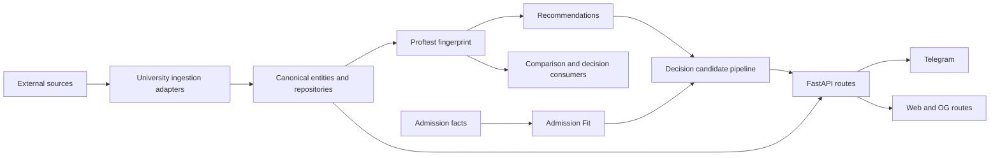
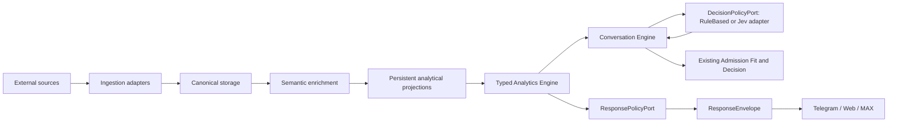

# Universal Analytics Dependency Direction

Этот документ фиксирует boundary для последующих semantic/analytics/conversation/presentation изменений. Andromeda остаётся modular monolith: новые контексты получают отдельные contracts/services/repository ports, но не отдельные deployment units.

## Current production graph

## Known direction risks

- `ProgramFingerprint` принадлежит `proftest`, хотя его данные переиспользуются recommendations и decision.
- Comparison и proftest имеют пересекающуюся workload/area aggregation логику.
- Telegram владеет program resolution, session flow и выбором text/image.
- OG routes имеют presentation-specific fetching/rendering boundary.
- Runtime catalog fingerprint building не масштабируется на 5,000+ программ.

## Target graph

## Enforced rules

1. Canonical entities remain the source of truth; semantic assignments, projections and caches are rebuildable derived data.
2. Subject modules import another subject only through `contracts.public` or `repository.ports`.
3. ORM, SQLAlchemy, FastAPI, ingestion adapters and channel SDKs stay outside subject modules.
4. Query inputs are typed `QuerySpec` values; neither Jev, LLM nor a channel can submit raw SQL.
5. Policies return typed decisions and response envelopes; channel adapters serialize/render them without owning business logic.
6. Jev and MAX are optional adapters. Their absence must not disable deterministic implementations or analytics domain tests.
